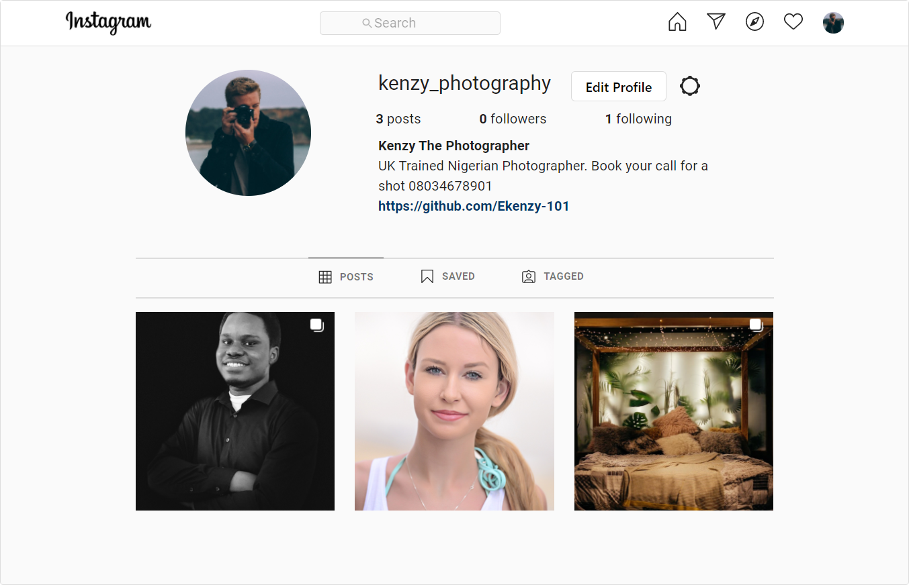

# INSTAGRAM CLONE WEBSITE

## LIVE DEMO

[Demo](https://kenzyreactinstagram.herokuapp.com)

## TECHNOLOGY STACKS

- React
- Laravel
- GraphQL
- Typescript
- PHP
- PostgreSQL
- AWS S3

## SETUP

- Make sure you have your server setup. [For more info click here](https://github.com/Ekenzy-101/Laravel-Instagram-API)
- Clone this repo by typing `git clone <repo url>`
- Go to the directory of repo by typing `cd <name of folder>`
- Type `npm install` to install all dependencies
- Set these environment variables
  `REACT_APP_API_URL=<Your Rest API Endpoint> http://.../api`
  `REACT_APP_GRAPHQL_API=<Your GraphQL API Endpoint e.g http://.../graphql>`
  `REACT_APP_FACEBOOK_APP_ID=<Your Facebook App ID>`
